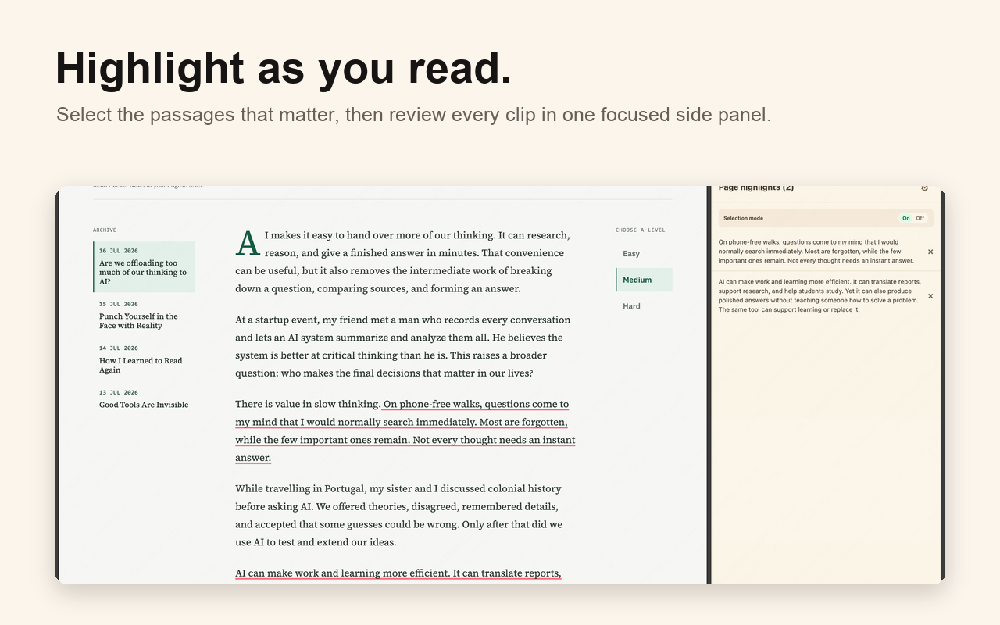
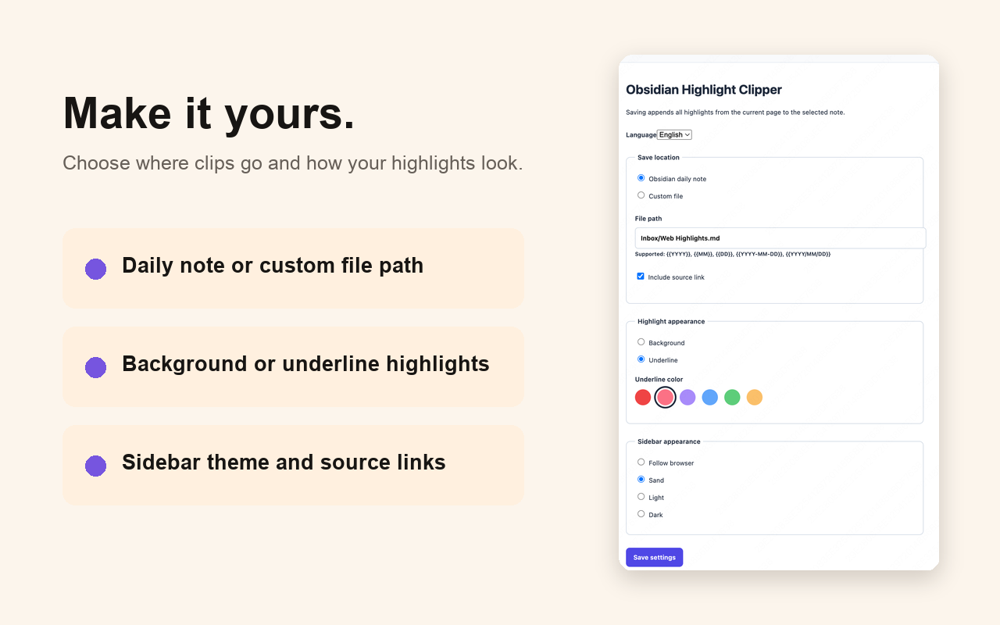
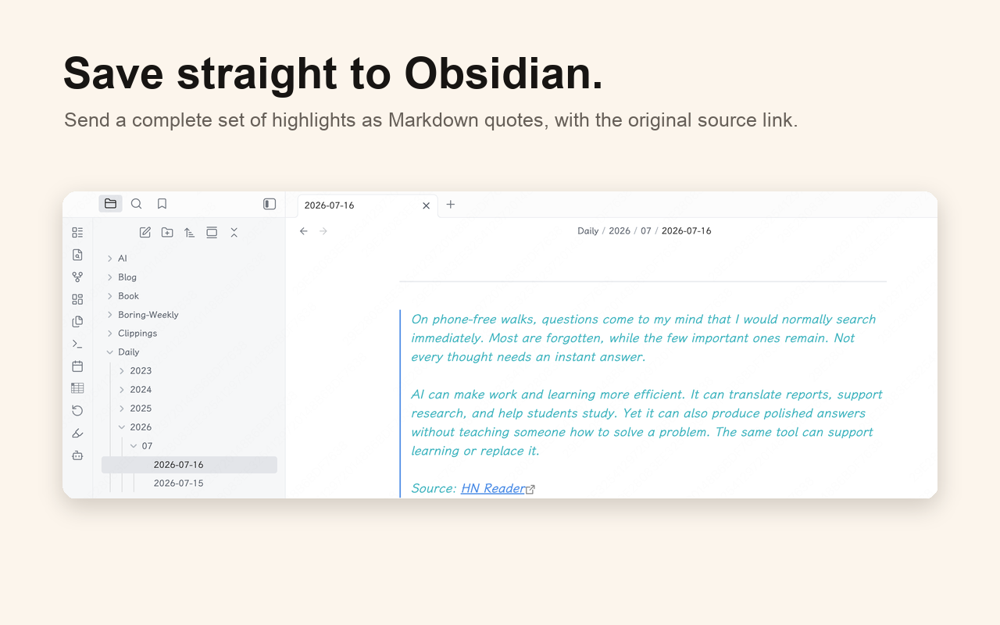

# Obsidian Highlight Clipper

[English](README.en.md)

高亮网页中的关键片段，沉淀到 Obsidian。

## 展示

### 网页高亮与收集

### 自定义剪藏方式与外观

### 保存到 Obsidian

## 功能

- 使用 Chrome 原生侧边栏，不遮挡或改动网页布局。
- 支持跨 Tab 暂存剪藏；刷新页面不会丢失，完整退出 Chrome 后自动清空。
- 将全部暂存剪藏以 Markdown 引用块追加到 Obsidian 日志或自定义文件，并保留各自的原文链接。
- 支持简体中文和英文界面。
- 侧边栏支持跟随浏览器、米色、浅色和深色外观。

## 安装

### Chrome 应用商店

访问 [Obsidian Highlight Clipper](https://chromewebstore.google.com/detail/obsidian-highlight-clippe/lomkeaeodebhbldkkeoajjnpkofdlheg) 并点击「添加至 Chrome」。

### 本地开发者模式

1. 打开 `chrome://extensions`。
2. 开启「开发者模式」，选择「加载已解压的扩展程序」。
3. 选择本项目目录。
4. 点击扩展图标，即可进入选择模式并打开侧边栏。

## 使用

- macOS 按 `Control + Shift + H`，Windows/Linux 按 `Alt + Shift + H`，可切换选择模式。开启后，选中文字即可高亮。
- 通过侧边栏右上角齿轮设置保存位置、原文链接、外观和语言。
- 所有暂存剪藏会汇总到侧边栏；选择模式按 Tab 独立。

### 自定义文件日期变量

自定义文件路径支持以下本地日期变量：

- `{{YYYY}}`
- `{{MM}}`
- `{{DD}}`
- `{{YYYY-MM-DD}}`
- `{{YYYY/MM/DD}}`

示例：`Inbox/{{YYYY/MM/DD}} Highlights.md`。

自定义文件还需要在设置中填写 Obsidian 的 Vault 名称，或 Vault 的本机绝对路径（例如 `/Users/me/Documents/My Vault`），以确保剪藏写入指定知识库。

## 注意事项

- 暂存剪藏在当前 Chrome 会话内保留；完整退出 Chrome 后会自动清空。
- 日志使用 `obsidian://daily`，自定义文件使用 `obsidian://new`；系统需要安装并注册 Obsidian。
- 首次打开 Obsidian 时，Chrome 可能要求确认；「复制」可作为备用方式。
